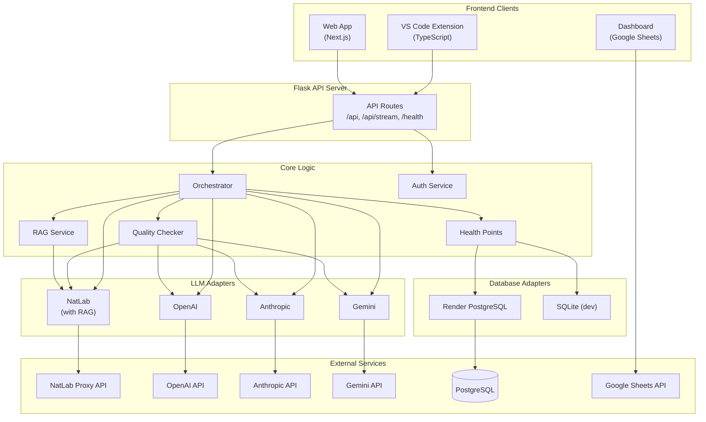

# CS-15 Tutor

An AI-powered tutoring system for CS 15: Data Structures at Tufts University.

## Project Structure

```
CS-15-Tutor/
├── adapters/               # External service adapters
│   ├── llm/               # LLM provider adapters
│   │   ├── base.py        # Abstract LLM interface
│   │   ├── natlab.py      # NatLab proxy (with RAG support)
│   │   ├── openai_adapter.py
│   │   ├── anthropic_adapter.py
│   │   └── gemini_adapter.py
│   └── database/          # Database adapters
│       ├── base.py        # Abstract database interface
│       └── render_postgres.py  # Render PostgreSQL/SQLite
│
├── core/                  # Core business logic
│   ├── orchestrator.py    # Main request orchestration
│   ├── rag_service.py     # RAG retrieval & formatting
│   ├── quality_checker.py # Response quality validation
│   ├── health_points.py   # Rate limiting service
│   ├── auth_service.py    # Authentication (LDAP, JWT)
│   └── config.py          # Centralized configuration
│
├── server/                # Flask API server
│   ├── app.py            # Application factory
│   └── routes/           # API route blueprints
│       ├── chat.py       # /api, /api/stream
│       ├── auth.py       # /vscode-auth endpoints
│       └── health.py     # /health, /analytics
│
├── frontend/             # Client applications
│   ├── web-app/         # Next.js web application
│   ├── vscode-extension/ # VS Code extension
│   └── dashboard/       # Google Sheets sync module
│
├── shared/               # Shared resources
│   ├── system_prompt.txt # AI system prompt
│   └── course-content/   # Course PDFs and specs
│
├── config/               # Configuration files
│   ├── settings.py       # Settings re-export
│   └── providers.json    # Provider configurations
│
└── responses-api-server/ # Legacy code (can be removed)
```

## Quick Start

### Installation

```bash
# Install Python dependencies
pip install -r requirements.txt
```

### Running the Server

```bash
# Option 1: Using run.py
python run.py

# Option 2: Using module syntax
python -m server.app
```

### Environment Variables

| Variable | Description | Default |
|----------|-------------|---------|
| `LLM_PROVIDER` | LLM provider to use | `natlab` |
| `DATABASE_URL` | Database connection string | SQLite local |
| `JWT_SECRET` | Secret for JWT tokens | (required for production) |
| `DEVELOPMENT_MODE` | Enable development features | `false` |
| `NATLAB_API_KEY` | NatLab proxy API key | (from config.json) |
| `NATLAB_ENDPOINT` | NatLab proxy endpoint | (from config.json) |
| `OPENAI_API_KEY` | OpenAI API key | (optional) |
| `ANTHROPIC_API_KEY` | Anthropic API key | (optional) |
| `GEMINI_API_KEY` | Google Gemini API key | (optional) |

## LLM Providers

The system supports multiple LLM providers that can be switched via the `LLM_PROVIDER` environment variable:

- **natlab** (default): Tufts NatLab proxy with RAG support
- **openai**: OpenAI GPT models
- **anthropic**: Anthropic Claude models  
- **gemini**: Google Gemini models

Note: Only NatLab supports RAG retrieval. Other providers use the same system prompt but without course-specific context retrieval.

## API Endpoints

| Endpoint | Method | Description |
|----------|--------|-------------|
| `/api` | POST | Main chat endpoint |
| `/api/stream` | POST | Streaming chat endpoint (SSE) |
| `/health` | GET | Health check |
| `/health-status` | GET | User health points status |
| `/vscode-auth` | GET/POST | VSCode authentication flow |
| `/vscode-direct-auth` | POST | Direct VSCode authentication |
| `/vscode-auth-status` | GET | Check VSCode auth status |
| `/analytics` | GET | System analytics |

## Architecture



### Data Flow

1. **User sends message** → Web App or VS Code Extension
2. **Request hits Flask API** → Routes to appropriate handler
3. **Authentication** → Auth Service validates JWT/LDAP
4. **Orchestrator processes request**:
   - RAG Service retrieves relevant course content (NatLab only)
   - LLM Adapter generates response
   - Quality Checker validates response
   - Health Points Service manages rate limiting
5. **Response returned** → Logged to database → Sent to client

## Development

### Adding a New LLM Provider

1. Create a new adapter in `adapters/llm/`
2. Inherit from `BaseLLMAdapter`
3. Implement `generate()` and `generate_stream()`
4. Register in `adapters/llm/__init__.py`

### Adding a New Database Provider

1. Create a new adapter in `adapters/database/`
2. Inherit from `BaseDatabaseAdapter`
3. Implement all abstract methods
4. Register in `adapters/database/__init__.py`

## Deployment

### Render.com

The project includes a `render.yaml` configuration file for deployment on Render.com:

```bash
# Deploy using render.yaml
# Start command: python -m server.app
```

### Environment Setup for Production

```bash
export LLM_PROVIDER=natlab
export DATABASE_URL=postgresql://...
export JWT_SECRET=your-secure-secret
export DEVELOPMENT_MODE=false
```

